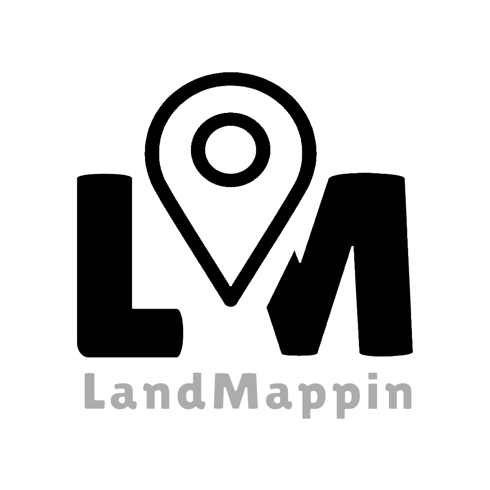

<p align="center">
  
</p>

<p align="center">
  <a href="https://flutter.dev"></a>
  <a href="https://pub.dev/packages/hive"></a>
  <a href="https://pub.dev/packages/google_maps_flutter"></a>
  <a href="https://pub.dev/packages/noto_sans"></a>
  <a href="https://github.com/iyinusa/landmappin/blob/main/LICENSE"></a>
</p>

LandMappin is a sleek indoor/outdoor navigation solution for overlaying custom architectural or landscape images on Google Maps, with geo-referenced points and real-time navigation. Solution for large events or complex site/building navigation.

# Screenshots

<p align="center">
  
  
  
  
</p>
<p align="center">
  
  
  
  
</p>

## Features

- **Image Upload:** Upload floorplans, estate layouts, or park maps (PNG/JPG).
- **Coordinate Mapping Tool:** Place and geo-reference points on images using calibration or manual entry.
- **Custom Overlay:** Overlay images on Google Maps, accurately attached to coordinates.
- **Custom Markers:** Clickable markers at mapped locations with info and navigation help.
- **Visitor View:** End-users can navigate, interact with overlays, and get real-time directions.
- **Multiple Map Projects:** Store multiple projects and their mappings using Hive DB.
- **Beautiful UI:** Modern, animated, and visually appealing design using Noto Sans font and a black/white color scheme.

## Try LandMappin

You can try LandMappin on your Android device:

- [Download LandMappin.apk from the repository root](./LandMappin.apk)
- Or [download from Google Drive](https://drive.google.com/file/d/1f-etWV2puttWS2ZZI8SmhJZn--WVW3MY/view?usp=sharing)

We strongly recommend **Download from Google Drive** because the APK will be scanned by Google before installing on your device, for safety. 

You may need to enable installation from unknown sources in your device settings.

LandMappin includes an **Import Demo** feature in the app settings. This allows you to quickly try the app with a pre-configured demo map:

1. Open the app and go to **Settings** icon, at the top right of the app.
2. Tap **Import Demo Data**, to import pre-configured overlay floorplan.
3. The demo map and data will be loaded, so you can explore navigation and features without manual setup below.

---

### Prerequisites
- [Flutter SDK](https://flutter.dev/docs/get-started/install)
- Android Studio or Xcode (for mobile development)

### Installation
1. Clone the repository:
   ```sh
   git clone https://github.com/yourusername/landmappin.git
   cd landmappin
   ```
2. Install dependencies:
   ```sh
   flutter pub get
   ```
3. Run the app:
   ```sh
   flutter run
   ```


### Google Maps API Key Setup (Android)

To enable Google Maps, you must add your API key to the Android project:

1. Open `android/app/src/main/AndroidManifest.xml`.
2. Inside the `<application>` tag, add:
   ```xml
   <meta-data
       android:name="com.google.android.geo.API_KEY"
       android:value="YOUR_API_KEY_HERE" />
   ```
3. Replace `YOUR_API_KEY_HERE` with your actual Google Maps API key.
4. For more details, see the [Google Maps Flutter documentation](https://pub.dev/packages/google_maps_flutter).

### Assets & Fonts
- All images and fonts are located in the `assets/` directory.
- Uses Google Font **Noto Sans** for a modern look.

## Usage

1. Launch the app and add a new map project.
2. Upload your custom image (floorplan, estate, etc.).
3. Place points and calibrate them to GPS coordinates.
4. Overlay the image on Google Maps and interact with custom markers.
5. Use the navigation tool to find paths between points.

## Technologies Used

- **Flutter** (UI framework)
- **Hive** (local DB)
- **Google Maps Flutter** (map integration)
- **Noto Sans** (font)
- **Image Picker, File Picker, Path Provider, Geolocator, Shimmer, Share Plus, HTTP** (various features)

## Folder Structure

```
lib/
  main.dart
  db/
  models/
  services/
  views/
  widgets/
assets/
  images/
  demo/
  fonts/
android/
ios/
web/
test/
```

## Contributing

Contributions are welcome! Please open issues or submit pull requests for improvements, bug fixes, or new features.


## Acknowledgements

Special thanks to [Lost Shore Surf Resort](https://www.lostshore.com/) for providing the resort map used in this project. Lost Shore Surf Resort is a world-class surf destination near Edinburgh, Scotland, offering luxury accommodation, surf schools, wellness treatments, and more. Their support and resources have been invaluable to LandMappin.

## License

This project is licensed under the Apache License 2.0. See the [LICENSE](LICENSE) file for details.
